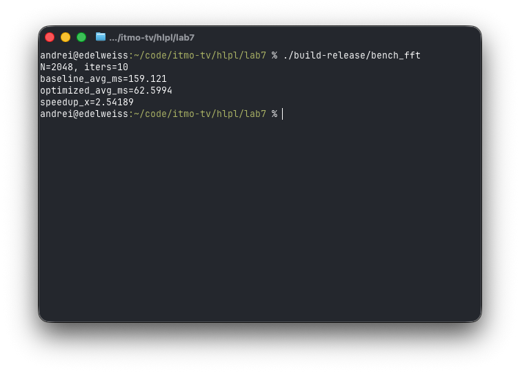

## Исправления

### 1. fftw_plan

Создание `fftw_plan` и `fftw_alloc` на каждый запуск - это дорого, лучше переиспользовать план при повторных вычислениях

В `CalcFFT` добавлены `m_buf/m_plan` и `EnsurePlan()` — аллокация и построение плана делаются один раз на размер, дальше только `fftw_execute`.

### 2. Сдвиг спектра

Прежний `ShiftSample` делает 2 полных копии матрицы и делает `%` для каждого элемента. Для четных `N` можно упростить.

Для чётных размеров (512/1024/2048) сделан in-place swap квадрантов без `tmp` и без `%`

### 3. Лишние накладные расходы на `operator()(y,x)`

`operator()` в `Sample` делает проверки границ: двойные циклы и вызовы `operator()` дают лишнюю нагрузку на больших N. 

Использованы GetDataPointer() и один линейный проход по памяти.

## Сравнение производительности

Был создан бенчмарк скрипт, результат сравнения:

